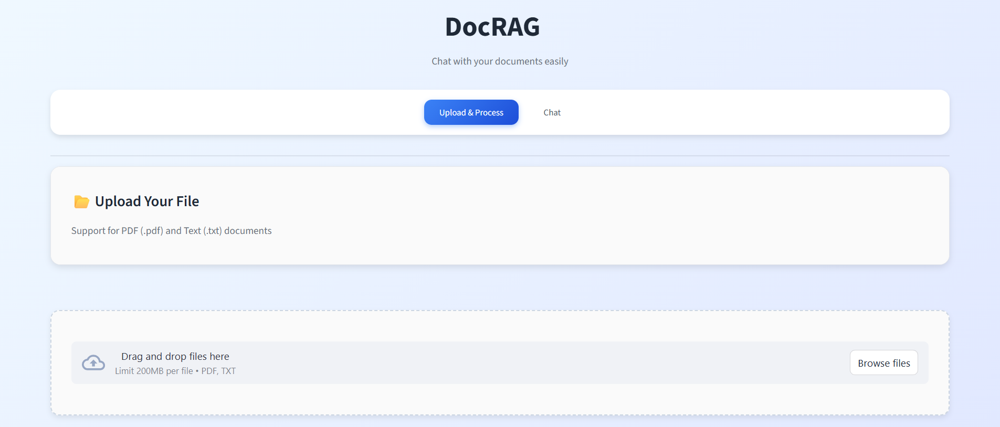
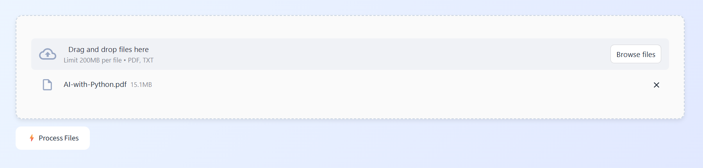
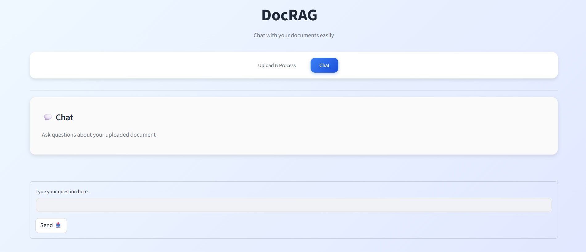
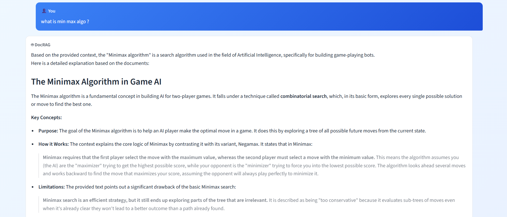

<div align="center">                                    
<h1> DocRAG - Chat with Your Documents</h1>
</div>
<div align="center">


*A powerful RAG (Retrieval-Augmented Generation) application that allows you to chat with your documents using AI*

[Features](#features) • [Demo](#demo) • [Installation](#installation) • [Usage](#usage) • [API Documentation](#api-documentation)

</div>

---

## 🌟 Features

### 📄 **Multi-Format Document Support**
- **PDF Documents** - Extract and process PDF files
- **Text Files** - Support for .txt and .md files
- **Batch Processing** - Upload multiple documents simultaneously

### 🤖 **Advanced AI Chat**
- **Context-Aware Responses** - AI understands your document content
- **Conversation Memory** - Maintains chat history for better context
- **Source Citations** - See which documents provided the information
- **Deep Explanations** - Detailed responses with highlighted key points

### 🎨 **Beautiful User Interface**
- **Modern Design** - Clean, gradient-based UI with smooth animations
- **Real-time Chat** - Interactive chat bubbles with message history
- **Responsive Layout** - Works perfectly on desktop and mobile
- **Intuitive Navigation** - Tab-based interface for easy document management

### ⚡ **High Performance**
- **Fast Processing** - Efficient document chunking and vectorization
- **Smart Retrieval** - Advanced similarity search for relevant context
- **Memory Management** - Configurable conversation history limits
- **Error Handling** - Robust error handling with user-friendly messages

---

## 🎥 Demo

### Upload & Process Documents
Landing Page:

Upload documents example:


### Chat with Your Documents
Chat Page:

Chat Example:


---

```
 ________  ________  ________  ________  ________  ________     
|\   ___ \|\   __  \|\   ____\|\   __  \|\   __  \|\   ____\    
\ \  \_|\ \ \  \|\  \ \  \___|\ \  \|\  \ \  \|\  \ \  \___|    
 \ \  \ \\ \ \  \\\  \ \  \    \ \   _  _\ \   __  \ \  \  ___  
  \ \  \_\\ \ \  \\\  \ \  \____\ \  \\  \\ \  \ \  \ \  \|\  \ 
   \ \_______\ \_______\ \_______\ \__\\ _\\ \__\ \__\ \_______\
    \|_______|\|_______|\|_______|\|__|\|__|\|__|\|__|\|_______|

```


## 🚀 Installation

### Prerequisites
- Python 3.8+
- Google Gemini API Key

### 1. Clone the Repository
```bash
git clone https://github.com/yourusername/docrag.git
cd docrag
```

### 2. Install Dependencies
```bash
pip install -r requirements.txt
```

### 3. Environment Setup
Create a `.env` file in the root directory:
```env
GEMINI_API_KEY=your_google_gemini_api_key_here
```

### 4. Get Your Gemini API Key
1. Visit [Google AI Studio](https://makersuite.google.com/app/apikey)
2. Create a new API key
3. Copy and paste it into your `.env` file

---

## 🎯 Usage

### Starting the Application

1. **Start the FastAPI Backend**
```bash
python main.py
```
The API server will run on `http://localhost:8000`

2. **Launch the Streamlit Frontend**
```bash
streamlit run app.py
```
The web interface will open at `http://localhost:8501`

### Using DocRAG

#### 📤 **Upload Documents**
1. Navigate to the "Upload & Process" tab
2. Drag and drop your PDF or text files
3. Click "⚡ Process Files" to analyze your documents
4. Wait for the success message showing processed chunks

#### 💬 **Start Chatting**
1. Switch to the "Chat" tab
2. Type your question about the uploaded documents
3. Click "Send 📤" or press Enter
4. View AI responses with source citations
5. Continue the conversation with follow-up questions

---

## 🔧 Technical Architecture

### Backend Components
- **FastAPI Server** - RESTful API with automatic documentation
- **RAG Pipeline** - Custom document processing and retrieval system
- **Vector Store** - FAISS for efficient similarity search
- **Embeddings** - HuggingFace sentence transformers
- **LLM** - Google Gemini 2.5 Pro for response generation

### Frontend Components
- **Streamlit Interface** - Interactive web application
- **Custom CSS** - Modern styling with animations
- **Session Management** - Persistent chat history
- **Real-time Updates** - Dynamic UI updates

### Data Flow
```
Documents → Text Splitting → Embeddings → Vector Store
                ↓
User Query → Retrieval → Context + Query → LLM → Response
```

---

## 📖 API Documentation

### Core Endpoints

#### Upload Documents
```http
POST /upload-files/
Content-Type: multipart/form-data

files: List of files to upload
```

#### Chat with Documents
```http
POST /chat/
Content-Type: application/json

{
  "message": "Your question here"
}
```

#### Memory Management
```http
GET /memory/                    # Get full conversation history
GET /memory/recent/{n}          # Get recent N exchanges
POST /memory/search/           # Search conversation history
DELETE /memory/                # Clear all memory
```

### Interactive API Documentation
Visit `http://localhost:8000/docs` after starting the backend to explore the full API documentation with interactive testing.

---

## 🛠️ Configuration

### Environment Variables
| Variable | Description | Required |
|----------|-------------|----------|
| `GEMINI_API_KEY` | Google Gemini API key | Yes |

### Customizable Parameters
- **Chunk Size**: Modify `chunk_size` in `rag_pipeline.py`
- **Memory Length**: Configure `max_memory` for conversation history
- **Retrieval Count**: Adjust `k` parameter for document retrieval
- **Model Temperature**: Fine-tune response creativity

---

## 📁 Project Structure

```
DocRAG/
├── 📁 files/
│   ├── 📄 main.py          # FastAPI backend server
│   ├── 🎨 app.py           # Streamlit frontend
│   ├── ⚙️ rag_pipeline.py  # RAG processing pipeline
│   └── 🎭 styles.css       # Custom CSS styling
├── 📋 requirements.txt     # Python dependencies
├── 🔐 .env                 # Environment variables
└── 📖 README.md           # Project documentation
```

---

## 🔧 Dependencies

### Core Libraries
```python
fastapi>=0.68.0           # Web framework for API
streamlit>=1.0.0          # Interactive web interface
langchain>=0.1.0          # LLM application framework
langchain-huggingface     # HuggingFace integrations
langchain-google-genai    # Google Gemini integration
faiss-cpu>=1.7.0         # Vector similarity search
```

### Document Processing
```python
pypdf>=3.0.0             # PDF document processing
python-multipart>=0.0.5  # File upload handling
python-dotenv>=0.19.0    # Environment variable management
```

---

## ⭐ Show Your Support

If this project helped you, please consider giving it a ⭐ on GitHub!

---

<div align="center">

**Built by Himanshu Singh**

[⬆️ Back to Top](#-docrag---chat-with-your-documents)

</div>
